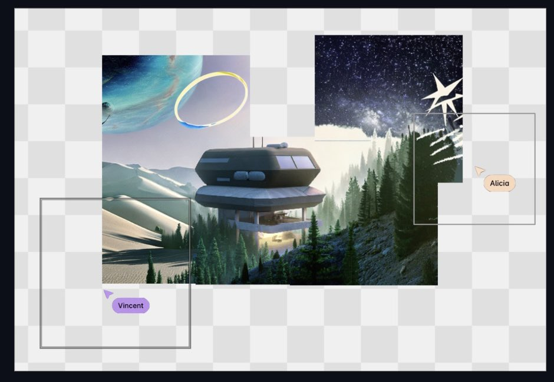

# growing-canvas
# stablediffusion-infinity-creative-sandbox

Infitnite/space is an interactive space for people to come together and collaborate on growning an image. The foundation of this project is based on this repo [stablediffusion-infinity by lkwq007](https://github.com/lkwq007/stablediffusion-infinity) and the concept is inspired by the Reddit project r/place - with the goal to foster creatvity and collaboration among people with generative AI. 

next steps:
- private launch and configure with hugging face
- rearchitecture tool bar into styled css buttons/minimalistic design
- intergrate liveblocks.io
- redesign ui/ux
- draw box moves window frame

